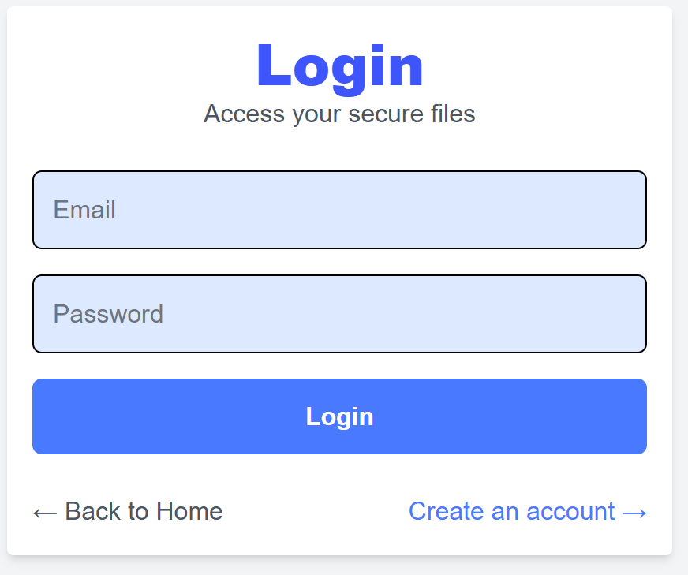
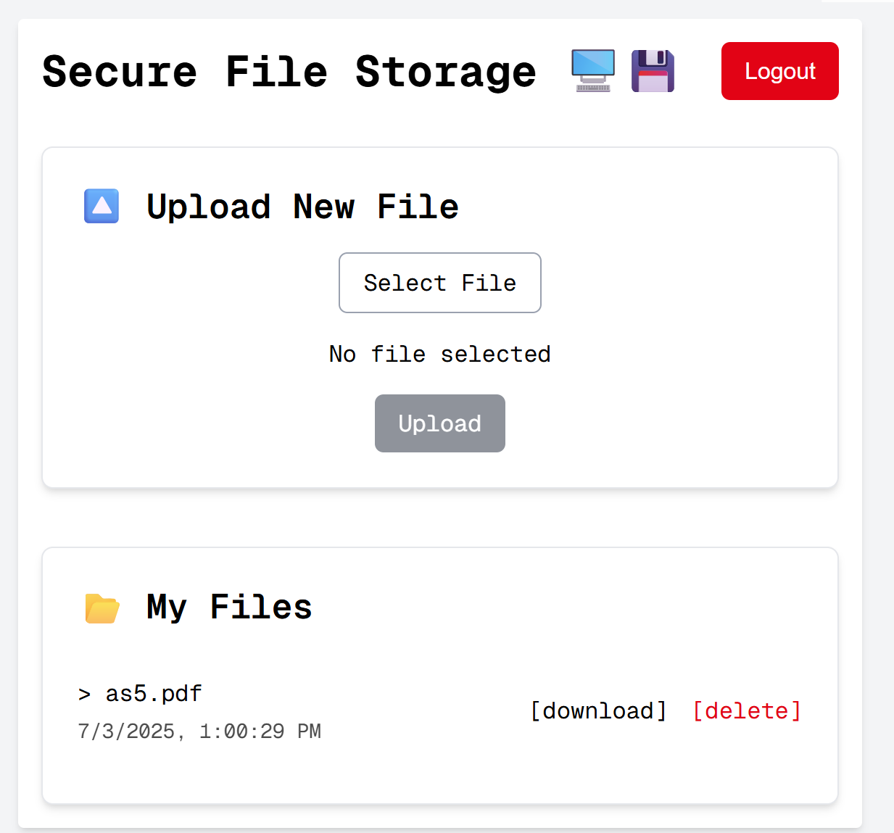

# 🔐 Secure File Storage System

A full-stack, encrypted file storage platform built with **Next.js**, **MongoDB**, **JWT Authentication**, and **SFTP over SSH**, containerized with Docker.

Built with love and security in mind by **Eden Cohen** & **Lior Engel** 💙


---

## 🚀 Features

- 🔐 Secure login with JWT and hashed passwords (bcrypt)
- 🔒 AES-256 file encryption and decryption
- 📤 File transfer over secure SSH/SFTP (via `ssh2-sftp-client`)
- 🧠 Persistent login using `localStorage` + AuthContext
- 📁 MongoDB-based metadata and access control
- 🐳 Fully containerized with Docker Compose

---

## 🧩 Tech Stack

- **Frontend**: Next.js (App Router)
- **Backend**: Node.js API Routes
- **Database**: MongoDB (via Mongoose)
- **Storage**: SFTP over SSH (running in a Docker container)
- **Security**: JWT + AES Encryption
- **Infrastructure**: Docker + Docker Compose

---

## 🛠 Requirements

| Tool           | Version          |
|----------------|------------------|
| Node.js        | 18+              |
| Docker         | Latest           |
| Docker Compose | Latest           |
| Git            | Any              |

---

## 📦 Setup & Run (Dockerized)

### 1. Clone the Project

```bash
git clone https://github.com/your-username/secure-file-storage.git
cd secure-file-storage
```

---

### 2. Create a `.env.docker` File

```env
JWT_SECRET=your_super_secret
ENCRYPTION_KEY=your_encryption_key
MONGODB_URI=mongodb://mongo:27017/securefilestorage

SFTP_HOST=ssh-server
SFTP_PORT=22
SFTP_USERNAME=sftpuser
SFTP_PASSWORD=password
```

---

### 3. Start Everything with Docker Compose

```bash
docker-compose up --build -d
```

This spins up:
- 📦 `mongo`: MongoDB database
- 🔐 `ssh-server`: SSH-enabled container for secure file storage
- 🌐 `file-storage-app`: The main app (Next.js server)

---

### 4. Open Your App

[http://localhost:3000](http://localhost:3000)

---

## 📁 Project Structure

```
Secure-File-Storage-System/
├── app/                # Next.js App Router
│   └── api/            # API endpoints
├── context/            # AuthContext (client state)
├── lib/                # DB, encryption, SFTP logic
├── models/             # Mongoose schemas
├── ssh-server/         # SSH/SFTP container setup
├── Dockerfile          # App container
├── docker-compose.yml  # Compose config for all services
├── .env.docker         # Docker-specific environment variables
```

---

## 🔐 Authentication Flow

- Login via `/login`
- Backend returns a signed JWT
- Token stored in `localStorage`
- `AuthContext` auto-authenticates and redirects to `/dashboard`
- All secure routes and file endpoints require this token

---

## 📤 File Upload Flow

1. File is encrypted with AES-256 and a unique IV
2. It is uploaded via SFTP to the SSH container
3. Metadata saved to MongoDB (`originalName`, `storedName`, `iv`, `userId`)

---

## 📥 File Download Flow

1. Auth token is validated
2. File is pulled from the SSH server via SFTP
3. File is decrypted using the stored IV
4. A binary stream is returned with the correct filename and headers

---

## 🖼️ Screenshots

> *(Add PNGs under `docs/` if you want them rendered below)*

```
docs/
├── login.png
├── dashboard.png
└── upload.png
```

```md



```

---

## 🧪 Useful Dev Commands

```bash
# Stop all containers
docker-compose down

# Live logs
docker-compose logs -f app

# SSH into the file server
docker exec -it ssh-server bash

# Connect to Mongo shell
docker exec -it mongo mongosh
```

---

## 📝 License

MIT © Eden Cohen & Lior Engel

---

> Built with ❤️ by Eden & Lior — for security, privacy, and awesome DevOps.
